<!-- README.md is generated from README.Rmd. Please edit that file -->

## APRENDIZADO DE MÁQUINA PARA PREDIÇÃO DA VARIABILIDADE ESPAÇO-TEMPORAL DA PRODUÇÃO DE CANA-DE-AÇÚCAR

## Carregando pacotes

``` r
library(tidyverse)
library(ggridges)
library(vegan)
library(corrplot)
theme_set(theme_bw())
```

## Lendo o banco de dados

``` r
data_set <- read_rds("data/sugarcane-soil.rds")  |> 
  rename_with(~ str_replace(., "_2$", ""), ends_with("_2"))
glimpse(data_set)
#> Rows: 41,586
#> Columns: 25
#> $ data      <dttm> 2016-12-20, 2016-12-20, 2016-12-20, 2016-12-20, 2016-12-20,…
#> $ ano       <dbl> 2016, 2016, 2016, 2016, 2016, 2016, 2016, 2016, 2016, 2016, …
#> $ ponto     <chr> "PF1687276", "PF1687273", "PF1687267", "PF1687282", "PF16872…
#> $ fazenda   <dbl> 63752, 63752, 63752, 63752, 63752, 63752, 63752, 63752, 6375…
#> $ ambiente  <chr> "B/A", "B/A", "B/A", "B/A", "B/A", "B/A", "B/A", "B/A", "B/A…
#> $ textura   <chr> "Media-Argilosa", "Media-Argilosa", "Media-Argilosa", "Media…
#> $ solos     <chr> "PVAe md-ar/md-arg", "PVAe md-ar/md-arg", "PVAe md-ar/md-arg…
#> $ x         <dbl> -49.50411, -49.50266, -49.50005, -49.50161, -49.50469, -49.4…
#> $ y         <dbl> -21.36912, -21.36896, -21.36864, -21.36746, -21.36732, -21.3…
#> $ unidade   <fct> POT, POT, POT, POT, POT, POT, POT, POT, POT, POT, POT, POT, …
#> $ corte     <dbl> 3.0, 3.0, 3.0, 3.0, 3.0, 3.0, 3.0, 3.0, 3.0, 3.0, 3.0, 3.0, …
#> $ variedade <fct> RB867515, RB867515, RB867515, RB867515, RB867515, RB867515, …
#> $ tch_real  <dbl> 64.68, 64.90, 64.90, 64.90, 64.68, 64.90, 64.90, 64.69, 64.6…
#> $ ca        <dbl> 18.756757, 14.905405, 22.878378, 13.891892, 13.418919, 23.21…
#> $ m         <dbl> 5.698356, 13.787017, 24.951824, 10.701406, 5.652951, 3.79898…
#> $ sb        <dbl> 28.927513, 24.162368, 37.909341, 19.192503, 19.961090, 37.27…
#> $ ctc       <dbl> 58.18001, 53.41487, 74.78771, 40.07696, 38.75824, 67.46658, …
#> $ p_resina  <dbl> 4.36410, 3.77882, 3.04722, 5.24202, 4.36410, 3.77882, 5.8273…
#> $ h_al      <dbl> 29.25250, 29.25250, 36.87837, 20.88445, 18.79715, 30.19134, …
#> $ v         <dbl> 49.72070, 45.23528, 50.68927, 47.88912, 51.50154, 55.24993, …
#> $ k         <dbl> 1.8546699, 2.2673108, 2.7826087, 0.8321256, 0.9730274, 2.074…
#> $ mg        <dbl> 8.316087, 6.989652, 12.248354, 4.468485, 5.569144, 11.984948…
#> $ mo        <dbl> 14.55940, 13.46420, 14.28560, 11.27380, 10.45240, 17.29740, …
#> $ ph_cacl2  <dbl> 5.14, 5.03, 4.55, 4.72, 5.07, 5.23, 4.06, 4.99, 4.78, 4.28, …
#> $ s         <dbl> 11.55523, 14.63704, 12.34360, 18.00553, 7.75672, 9.04678, 7.…
```

## 1. Análise Estatística Exploratória

Tabela com a estatística descritiva por unidade (CAT e POT) para as
variáveis numéricas (n, min, q1, mediana, média, q3, max, dp, epm, cv,
cassimetria, ccurtose) para as variáveis `tch_real` até `s_2`…nos
diferentes tempos, pra caracterizarmos a variabilidade total do conjunto
de dados

criando a função para a análise exploratória dos dados

``` r
estat_desc <- function(x){
  set.seed(1235)
  xs <- sample(x,500)
  normal <- nortest::lillie.test(xs)
  log_norm <- nortest::lillie.test(log(xs+1))
  n <- length(x)
  m <- mean(x,na.rm = TRUE)
  md <- median(x)
  mini <- min(x,na.rm = TRUE)
  q1 <- quantile(x,.25)
  q3 <- quantile(x,.75)
  maxi <- max(x,na.rm = TRUE)
  dp <- sd(x,na.rm = TRUE)
  epm <- dp/sqrt(n)
  cv <- 100*dp/m
  ass <- agricolae::skewness(x)
  curt <- agricolae::kurtosis(x)
  c(n,mini,q1,md,m,q3,maxi,dp,epm,cv,ass,curt,normal$p.value,log_norm$p.value)
}
estat_names <- c("n","Min","Q1","Med","Média","Q3",
                 "Max","DP","EP","CV","Skn","Krt","norm","log_norm")
```

Tabela de estatística descritiva presente no arquivo do excel na pasta
`output`.

``` r
data_set |> 
  group_by(ano,unidade) |> 
  reframe(
    across(.cols = tch_real:s,
           .fns = estat_desc,
           .names = "{.col}")
  )|> 
  add_column(estatistica = rep(estat_names,2*3)) |> 
  relocate(estatistica) |> 
  writexl::write_xlsx("output/estat-desc.xlsx")
```

Boxplot para comparação

``` r
var_names <- data_set |> select(tch_real:s) |> names()
map(var_names, ~{
    x<-data_set |> pull(!!sym(.x))
  q3 <- quantile(x,0.99)
  data_set |> 
    filter(!!sym(.x) <= q3) |>  
  ggplot(aes(x=as_factor(ano),y=!!sym(.x),fill=unidade)) +
  geom_boxplot() +
  scale_fill_manual(values=c("#009E73", "#D55E00")) +
  labs(x="Ano", y=.x)
})
#> [[1]]
```

<!-- -->

    #> 
    #> [[2]]

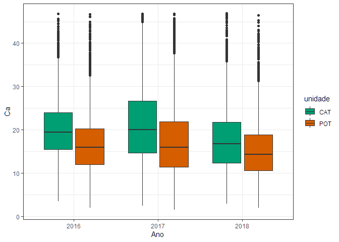<!-- -->

    #> 
    #> [[3]]

<!-- -->

    #> 
    #> [[4]]

<!-- -->

    #> 
    #> [[5]]

<!-- -->

    #> 
    #> [[6]]

<!-- -->

    #> 
    #> [[7]]

<!-- -->

    #> 
    #> [[8]]

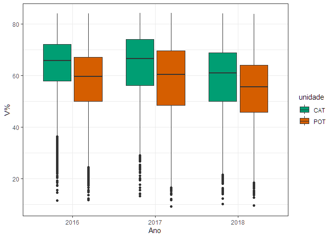<!-- -->

    #> 
    #> [[9]]

<!-- -->

    #> 
    #> [[10]]

<!-- -->

    #> 
    #> [[11]]

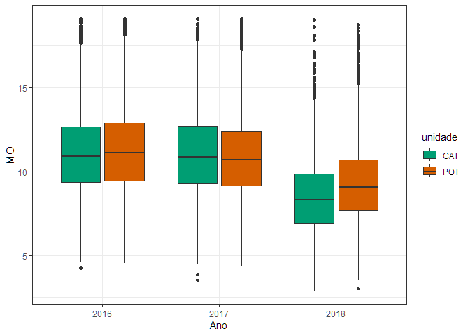<!-- -->

    #> 
    #> [[12]]

<!-- -->

    #> 
    #> [[13]]

<!-- -->

``` r
map(var_names, ~{
  x<-data_set |> pull(!!sym(.x))
  q3 <- quantile(x,0.99)
  data_set |> 
    filter(!!sym(.x) <= q3) |> 
    ggplot(aes(x=!!sym(.x),fill=unidade)) +
    geom_histogram(color="black") +
    scale_fill_manual(values=c("#009E73", "#D55E00")) +
    labs(x="Ano", y=.x)+
    facet_wrap(~ano,ncol=2)
})
#> [[1]]
```

<!-- -->

    #> 
    #> [[2]]

<!-- -->

    #> 
    #> [[3]]

<!-- -->

    #> 
    #> [[4]]

<!-- -->

    #> 
    #> [[5]]

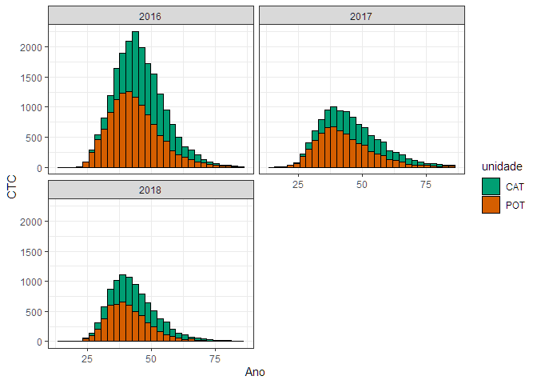<!-- -->

    #> 
    #> [[6]]

<!-- -->

    #> 
    #> [[7]]

<!-- -->

    #> 
    #> [[8]]

<!-- -->

    #> 
    #> [[9]]

<!-- -->

    #> 
    #> [[10]]

<!-- -->

    #> 
    #> [[11]]

<!-- -->

    #> 
    #> [[12]]

<!-- -->

    #> 
    #> [[13]]

<!-- -->

``` r
map(var_names, ~{
  x<-data_set |> pull(!!sym(.x))
  q3 <- quantile(x,0.99)
  data_set |> 
    filter(!!sym(.x) <= q3) |> 
    ggplot(aes(y=as_factor(ano))) +
    geom_density_ridges(rel_min_height = 0.03,
                        aes(x=!!sym(.x), fill=unidade),
                        alpha = .6, color = "black"
    ) +
    scale_fill_cyclical(values = c("#ff8080","#238B45"),
                        name = "classe", guide = "legend") +
    labs(y="Ano", x=.x)+
    theme_ridges()
})
#> [[1]]
```

<!-- -->

    #> 
    #> [[2]]

<!-- -->

    #> 
    #> [[3]]

<!-- -->

    #> 
    #> [[4]]

<!-- -->

    #> 
    #> [[5]]

<!-- -->

    #> 
    #> [[6]]

<!-- -->

    #> 
    #> [[7]]

<!-- -->

    #> 
    #> [[8]]

<!-- -->

    #> 
    #> [[9]]

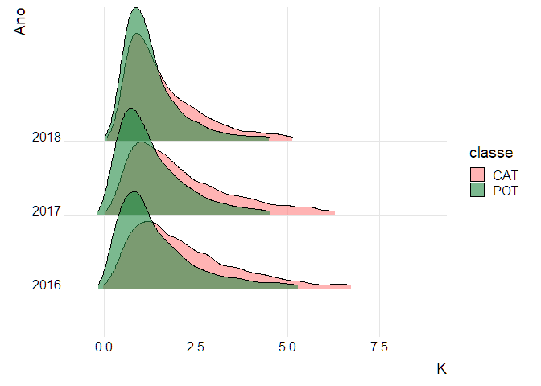<!-- -->

    #> 
    #> [[10]]

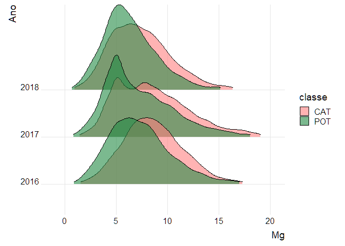<!-- -->

    #> 
    #> [[11]]

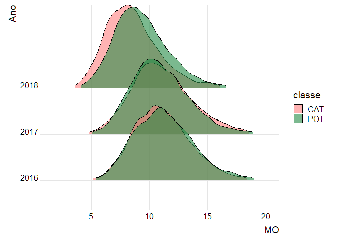<!-- -->

    #> 
    #> [[12]]

<!-- -->

    #> 
    #> [[13]]

<!-- -->

### Dados transformados com log

``` r
map(var_names, ~{
  x<-data_set |> pull(!!sym(.x))
  x<-log(x+1)
  q3 <- quantile(x,0.99)
  data_set |> 
    mutate(!!sym(.x) := log(!!sym(.x) +1)) |> 
    # filter(!!sym(.x) <= q3) |> 
    ggplot(aes(x=!!sym(.x),fill=unidade)) +
    geom_histogram(color="black") +
    scale_fill_manual(values=c("#009E73", "#D55E00")) +
    labs(x="Ano", y=paste0("log(",.x,"+1)"))+
    facet_wrap(~ano,ncol=2)
})
#> [[1]]
```

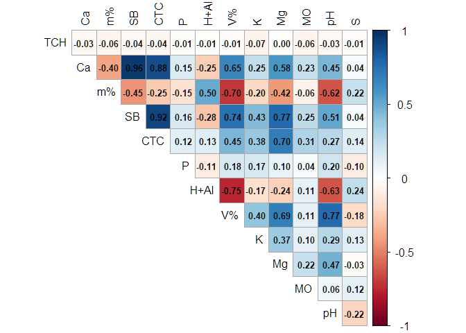<!-- -->

    #> 
    #> [[2]]

<!-- -->

    #> 
    #> [[3]]

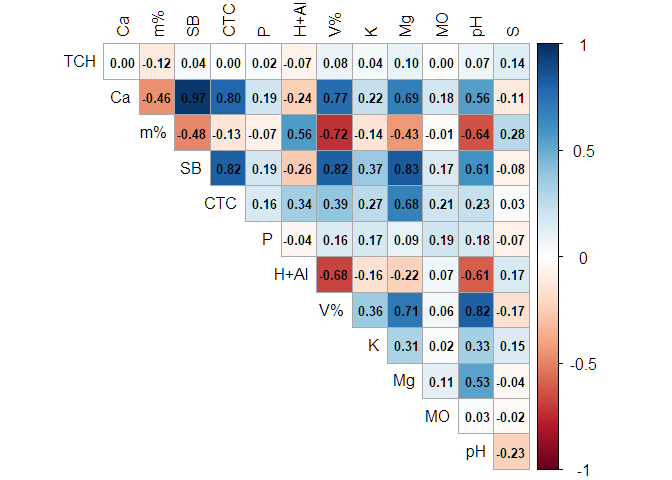<!-- -->

    #> 
    #> [[4]]

<!-- -->

    #> 
    #> [[5]]

<!-- -->

    #> 
    #> [[6]]

<!-- -->

    #> 
    #> [[7]]

<!-- -->

    #> 
    #> [[8]]

<!-- -->

    #> 
    #> [[9]]

<!-- -->

    #> 
    #> [[10]]

<!-- -->

    #> 
    #> [[11]]

<!-- -->

    #> 
    #> [[12]]

<!-- -->

    #> 
    #> [[13]]

<!-- -->

## 2. Matriz de correlação linear (corplot) fazer por ano (2016, 2017 e 2018) e por UNIDADE

Para CAT

``` r
map(2016:2018, ~{data_set |> filter(unidade == "CAT") |>  
    rename(TCH = tch_real,
           Ca = ca,
           `m%` = m,
           SB = sb,
           CTC = ctc,
           P = p_resina,
           `H+Al` = h_al,
           `V%` = v,
           K = k,
           Mg = mg,
           MO = mo,
           pH = ph_cacl2,
           S = s) |> 
  filter(ano == .x) |> 
  select(TCH:S) |> 
  cor() |> 
  corrplot::corrplot( method = "color",
         outline = T,,
         addgrid.col = "darkgray",cl.pos = "r", tl.col = "black",
         tl.cex = 1, cl.cex = 1, type = "upper", bg="azure2",
         diag = FALSE,
         addCoef.col = "black",
         cl.ratio = 0.2,
         cl.length = 5,
         number.cex = 0.8)}) 
```

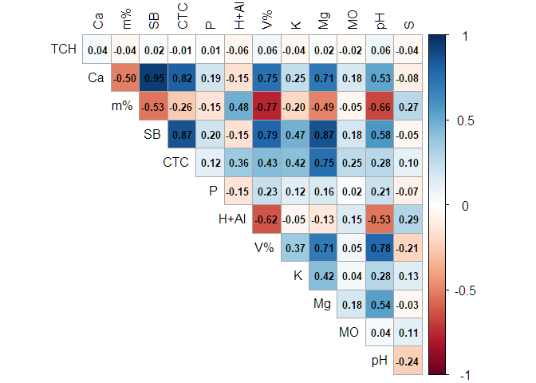<!-- --><!-- --><!-- -->

    #> [[1]]
    #> [[1]]$corr
    #>               TCH          Ca          m%          SB         CTC           P
    #> TCH   1.000000000 -0.03392004 -0.05619502 -0.03667912 -0.04185349 -0.01260770
    #> Ca   -0.033920038  1.00000000 -0.39670532  0.95570644  0.88375082  0.14503556
    #> m%   -0.056195024 -0.39670532  1.00000000 -0.44663829 -0.25212591 -0.15204882
    #> SB   -0.036679117  0.95570644 -0.44663829  1.00000000  0.91717335  0.16149248
    #> CTC  -0.041853487  0.88375082 -0.25212591  0.91717335  1.00000000  0.12233794
    #> P    -0.012607699  0.14503556 -0.15204882  0.16149248  0.12233794  1.00000000
    #> H+Al -0.009999754 -0.24588647  0.50333820 -0.27543771  0.13026908 -0.10604646
    #> V%   -0.012386805  0.65256354 -0.70376503  0.74185450  0.45328371  0.17765678
    #> K    -0.066636699  0.24893458 -0.20380988  0.43284255  0.37693794  0.17410446
    #> Mg   -0.004425978  0.58469807 -0.42243343  0.77154008  0.69806223  0.09573199
    #> MO   -0.056390412  0.23457837 -0.06297172  0.25417878  0.30575116  0.03912135
    #> pH   -0.032478621  0.45161240 -0.62479978  0.51459697  0.27069928  0.19855932
    #> S    -0.012173920  0.03516270  0.22415420  0.03769798  0.13894266 -0.10321950
    #>              H+Al         V%          K           Mg          MO          pH
    #> TCH  -0.009999754 -0.0123868 -0.0666367 -0.004425978 -0.05639041 -0.03247862
    #> Ca   -0.245886474  0.6525635  0.2489346  0.584698072  0.23457837  0.45161240
    #> m%    0.503338197 -0.7037650 -0.2038099 -0.422433433 -0.06297172 -0.62479978
    #> SB   -0.275437706  0.7418545  0.4328425  0.771540085  0.25417878  0.51459697
    #> CTC   0.130269084  0.4532837  0.3769379  0.698062226  0.30575116  0.27069928
    #> P    -0.106046459  0.1776568  0.1741045  0.095731987  0.03912135  0.19855932
    #> H+Al  1.000000000 -0.7519228 -0.1672741 -0.235669446  0.10506130 -0.62725754
    #> V%   -0.751922774  1.0000000  0.3969037  0.688537046  0.11206579  0.77264199
    #> K    -0.167274145  0.3969037  1.0000000  0.367379152  0.10455480  0.28770756
    #> Mg   -0.235669446  0.6885370  0.3673792  1.000000000  0.22218314  0.47464785
    #> MO    0.105061304  0.1120658  0.1045548  0.222183137  1.00000000  0.06407181
    #> pH   -0.627257541  0.7726420  0.2877076  0.474647848  0.06407181  1.00000000
    #> S     0.240746330 -0.1824502  0.1281485 -0.025565948  0.11585532 -0.21646860
    #>                S
    #> TCH  -0.01217392
    #> Ca    0.03516270
    #> m%    0.22415420
    #> SB    0.03769798
    #> CTC   0.13894266
    #> P    -0.10321950
    #> H+Al  0.24074633
    #> V%   -0.18245023
    #> K     0.12814852
    #> Mg   -0.02556595
    #> MO    0.11585532
    #> pH   -0.21646860
    #> S     1.00000000
    #> 
    #> [[1]]$corrPos
    #>    xName yName  x  y         corr
    #> 1     Ca   TCH  2 13 -0.033920038
    #> 2     m%   TCH  3 13 -0.056195024
    #> 3     m%    Ca  3 12 -0.396705317
    #> 4     SB   TCH  4 13 -0.036679117
    #> 5     SB    Ca  4 12  0.955706435
    #> 6     SB    m%  4 11 -0.446638288
    #> 7    CTC   TCH  5 13 -0.041853487
    #> 8    CTC    Ca  5 12  0.883750817
    #> 9    CTC    m%  5 11 -0.252125909
    #> 10   CTC    SB  5 10  0.917173346
    #> 11     P   TCH  6 13 -0.012607699
    #> 12     P    Ca  6 12  0.145035565
    #> 13     P    m%  6 11 -0.152048824
    #> 14     P    SB  6 10  0.161492476
    #> 15     P   CTC  6  9  0.122337938
    #> 16  H+Al   TCH  7 13 -0.009999754
    #> 17  H+Al    Ca  7 12 -0.245886474
    #> 18  H+Al    m%  7 11  0.503338197
    #> 19  H+Al    SB  7 10 -0.275437706
    #> 20  H+Al   CTC  7  9  0.130269084
    #> 21  H+Al     P  7  8 -0.106046459
    #> 22    V%   TCH  8 13 -0.012386805
    #> 23    V%    Ca  8 12  0.652563538
    #> 24    V%    m%  8 11 -0.703765026
    #> 25    V%    SB  8 10  0.741854505
    #> 26    V%   CTC  8  9  0.453283713
    #> 27    V%     P  8  8  0.177656781
    #> 28    V%  H+Al  8  7 -0.751922774
    #> 29     K   TCH  9 13 -0.066636699
    #> 30     K    Ca  9 12  0.248934578
    #> 31     K    m%  9 11 -0.203809878
    #> 32     K    SB  9 10  0.432842545
    #> 33     K   CTC  9  9  0.376937941
    #> 34     K     P  9  8  0.174104463
    #> 35     K  H+Al  9  7 -0.167274145
    #> 36     K    V%  9  6  0.396903695
    #> 37    Mg   TCH 10 13 -0.004425978
    #> 38    Mg    Ca 10 12  0.584698072
    #> 39    Mg    m% 10 11 -0.422433433
    #> 40    Mg    SB 10 10  0.771540085
    #> 41    Mg   CTC 10  9  0.698062226
    #> 42    Mg     P 10  8  0.095731987
    #> 43    Mg  H+Al 10  7 -0.235669446
    #> 44    Mg    V% 10  6  0.688537046
    #> 45    Mg     K 10  5  0.367379152
    #> 46    MO   TCH 11 13 -0.056390412
    #> 47    MO    Ca 11 12  0.234578368
    #> 48    MO    m% 11 11 -0.062971724
    #> 49    MO    SB 11 10  0.254178781
    #> 50    MO   CTC 11  9  0.305751156
    #> 51    MO     P 11  8  0.039121350
    #> 52    MO  H+Al 11  7  0.105061304
    #> 53    MO    V% 11  6  0.112065789
    #> 54    MO     K 11  5  0.104554803
    #> 55    MO    Mg 11  4  0.222183137
    #> 56    pH   TCH 12 13 -0.032478621
    #> 57    pH    Ca 12 12  0.451612400
    #> 58    pH    m% 12 11 -0.624799783
    #> 59    pH    SB 12 10  0.514596970
    #> 60    pH   CTC 12  9  0.270699275
    #> 61    pH     P 12  8  0.198559317
    #> 62    pH  H+Al 12  7 -0.627257541
    #> 63    pH    V% 12  6  0.772641994
    #> 64    pH     K 12  5  0.287707560
    #> 65    pH    Mg 12  4  0.474647848
    #> 66    pH    MO 12  3  0.064071808
    #> 67     S   TCH 13 13 -0.012173920
    #> 68     S    Ca 13 12  0.035162704
    #> 69     S    m% 13 11  0.224154195
    #> 70     S    SB 13 10  0.037697978
    #> 71     S   CTC 13  9  0.138942655
    #> 72     S     P 13  8 -0.103219499
    #> 73     S  H+Al 13  7  0.240746330
    #> 74     S    V% 13  6 -0.182450234
    #> 75     S     K 13  5  0.128148524
    #> 76     S    Mg 13  4 -0.025565948
    #> 77     S    MO 13  3  0.115855320
    #> 78     S    pH 13  2 -0.216468596
    #> 
    #> [[1]]$arg
    #> [[1]]$arg$type
    #> [1] "upper"
    #> 
    #> 
    #> 
    #> [[2]]
    #> [[2]]$corr
    #>              TCH          Ca          m%          SB         CTC           P
    #> TCH   1.00000000  0.10527806 -0.06130692  0.13380524  0.11577277  0.17447966
    #> Ca    0.10527806  1.00000000 -0.44377009  0.96859480  0.90545550  0.28578740
    #> m%   -0.06130692 -0.44377009  1.00000000 -0.46859861 -0.28844039 -0.15527229
    #> SB    0.13380524  0.96859480 -0.46859861  1.00000000  0.92995461  0.30325997
    #> CTC   0.11577277  0.90545550 -0.28844039  0.92995461  1.00000000  0.26427043
    #> P     0.17447966  0.28578740 -0.15527229  0.30325997  0.26427043  1.00000000
    #> H+Al -0.06456208 -0.29338729  0.52802367 -0.31543658  0.05555953 -0.14147364
    #> V%    0.12808868  0.76960304 -0.71772402  0.81396483  0.58340513  0.27052165
    #> K     0.10554565  0.28759233 -0.22109781  0.42173845  0.37356417  0.23368713
    #> Mg    0.15374237  0.70748540 -0.40961338  0.84046827  0.77759392  0.22956080
    #> MO    0.07117072  0.34465183 -0.13959946  0.36609072  0.37684831  0.28556840
    #> pH   -0.01508469  0.54194748 -0.62814791  0.58321409  0.38594701  0.25213218
    #> S    -0.05165169 -0.02810068  0.16125553 -0.01020503  0.04179923 -0.01257777
    #>             H+Al          V%          K          Mg          MO          pH
    #> TCH  -0.06456208  0.12808868  0.1055457  0.15374237  0.07117072 -0.01508469
    #> Ca   -0.29338729  0.76960304  0.2875923  0.70748540  0.34465183  0.54194748
    #> m%    0.52802367 -0.71772402 -0.2210978 -0.40961338 -0.13959946 -0.62814791
    #> SB   -0.31543658  0.81396483  0.4217384  0.84046827  0.36609072  0.58321409
    #> CTC   0.05555953  0.58340513  0.3735642  0.77759392  0.37684831  0.38594701
    #> P    -0.14147364  0.27052165  0.2336871  0.22956080  0.28556840  0.25213218
    #> H+Al  1.00000000 -0.70463709 -0.1811234 -0.27543551 -0.02154048 -0.58764316
    #> V%   -0.70463709  1.00000000  0.3953570  0.70983401  0.24278567  0.78458743
    #> K    -0.18112336  0.39535703  1.0000000  0.30928249  0.18225475  0.34931104
    #> Mg   -0.27543551  0.70983401  0.3092825  1.00000000  0.32119045  0.50443538
    #> MO   -0.02154048  0.24278567  0.1822547  0.32119045  1.00000000  0.22543732
    #> pH   -0.58764316  0.78458743  0.3493110  0.50443538  0.22543732  1.00000000
    #> S     0.13557209 -0.09606306  0.1394861 -0.02390304 -0.02380314 -0.09620812
    #>                S
    #> TCH  -0.05165169
    #> Ca   -0.02810068
    #> m%    0.16125553
    #> SB   -0.01020503
    #> CTC   0.04179923
    #> P    -0.01257777
    #> H+Al  0.13557209
    #> V%   -0.09606306
    #> K     0.13948607
    #> Mg   -0.02390304
    #> MO   -0.02380314
    #> pH   -0.09620812
    #> S     1.00000000
    #> 
    #> [[2]]$corrPos
    #>    xName yName  x  y        corr
    #> 1     Ca   TCH  2 13  0.10527806
    #> 2     m%   TCH  3 13 -0.06130692
    #> 3     m%    Ca  3 12 -0.44377009
    #> 4     SB   TCH  4 13  0.13380524
    #> 5     SB    Ca  4 12  0.96859480
    #> 6     SB    m%  4 11 -0.46859861
    #> 7    CTC   TCH  5 13  0.11577277
    #> 8    CTC    Ca  5 12  0.90545550
    #> 9    CTC    m%  5 11 -0.28844039
    #> 10   CTC    SB  5 10  0.92995461
    #> 11     P   TCH  6 13  0.17447966
    #> 12     P    Ca  6 12  0.28578740
    #> 13     P    m%  6 11 -0.15527229
    #> 14     P    SB  6 10  0.30325997
    #> 15     P   CTC  6  9  0.26427043
    #> 16  H+Al   TCH  7 13 -0.06456208
    #> 17  H+Al    Ca  7 12 -0.29338729
    #> 18  H+Al    m%  7 11  0.52802367
    #> 19  H+Al    SB  7 10 -0.31543658
    #> 20  H+Al   CTC  7  9  0.05555953
    #> 21  H+Al     P  7  8 -0.14147364
    #> 22    V%   TCH  8 13  0.12808868
    #> 23    V%    Ca  8 12  0.76960304
    #> 24    V%    m%  8 11 -0.71772402
    #> 25    V%    SB  8 10  0.81396483
    #> 26    V%   CTC  8  9  0.58340513
    #> 27    V%     P  8  8  0.27052165
    #> 28    V%  H+Al  8  7 -0.70463709
    #> 29     K   TCH  9 13  0.10554565
    #> 30     K    Ca  9 12  0.28759233
    #> 31     K    m%  9 11 -0.22109781
    #> 32     K    SB  9 10  0.42173845
    #> 33     K   CTC  9  9  0.37356417
    #> 34     K     P  9  8  0.23368713
    #> 35     K  H+Al  9  7 -0.18112336
    #> 36     K    V%  9  6  0.39535703
    #> 37    Mg   TCH 10 13  0.15374237
    #> 38    Mg    Ca 10 12  0.70748540
    #> 39    Mg    m% 10 11 -0.40961338
    #> 40    Mg    SB 10 10  0.84046827
    #> 41    Mg   CTC 10  9  0.77759392
    #> 42    Mg     P 10  8  0.22956080
    #> 43    Mg  H+Al 10  7 -0.27543551
    #> 44    Mg    V% 10  6  0.70983401
    #> 45    Mg     K 10  5  0.30928249
    #> 46    MO   TCH 11 13  0.07117072
    #> 47    MO    Ca 11 12  0.34465183
    #> 48    MO    m% 11 11 -0.13959946
    #> 49    MO    SB 11 10  0.36609072
    #> 50    MO   CTC 11  9  0.37684831
    #> 51    MO     P 11  8  0.28556840
    #> 52    MO  H+Al 11  7 -0.02154048
    #> 53    MO    V% 11  6  0.24278567
    #> 54    MO     K 11  5  0.18225475
    #> 55    MO    Mg 11  4  0.32119045
    #> 56    pH   TCH 12 13 -0.01508469
    #> 57    pH    Ca 12 12  0.54194748
    #> 58    pH    m% 12 11 -0.62814791
    #> 59    pH    SB 12 10  0.58321409
    #> 60    pH   CTC 12  9  0.38594701
    #> 61    pH     P 12  8  0.25213218
    #> 62    pH  H+Al 12  7 -0.58764316
    #> 63    pH    V% 12  6  0.78458743
    #> 64    pH     K 12  5  0.34931104
    #> 65    pH    Mg 12  4  0.50443538
    #> 66    pH    MO 12  3  0.22543732
    #> 67     S   TCH 13 13 -0.05165169
    #> 68     S    Ca 13 12 -0.02810068
    #> 69     S    m% 13 11  0.16125553
    #> 70     S    SB 13 10 -0.01020503
    #> 71     S   CTC 13  9  0.04179923
    #> 72     S     P 13  8 -0.01257777
    #> 73     S  H+Al 13  7  0.13557209
    #> 74     S    V% 13  6 -0.09606306
    #> 75     S     K 13  5  0.13948607
    #> 76     S    Mg 13  4 -0.02390304
    #> 77     S    MO 13  3 -0.02380314
    #> 78     S    pH 13  2 -0.09620812
    #> 
    #> [[2]]$arg
    #> [[2]]$arg$type
    #> [1] "upper"
    #> 
    #> 
    #> 
    #> [[3]]
    #> [[3]]$corr
    #>               TCH           Ca          m%          SB          CTC           P
    #> TCH   1.000000000  0.004665114 -0.11921728  0.03659246 -0.003244622  0.02355334
    #> Ca    0.004665114  1.000000000 -0.45946596  0.96518694  0.798004990  0.19212912
    #> m%   -0.119217282 -0.459465964  1.00000000 -0.48290316 -0.134508889 -0.07432172
    #> SB    0.036592458  0.965186939 -0.48290316  1.00000000  0.819054500  0.18965853
    #> CTC  -0.003244622  0.798004990 -0.13450889  0.81905450  1.000000000  0.16012746
    #> P     0.023553342  0.192129116 -0.07432172  0.18965853  0.160127458  1.00000000
    #> H+Al -0.065371309 -0.236641030  0.56420316 -0.25820127  0.342780598 -0.04090450
    #> V%    0.080395117  0.766371077 -0.72040166  0.81644493  0.392601410  0.15743913
    #> K     0.040305941  0.222733158 -0.14452916  0.37253980  0.269005612  0.17182088
    #> Mg    0.097823357  0.686706458 -0.43428891  0.83486685  0.679367451  0.09442044
    #> MO   -0.001417498  0.180722943 -0.01402951  0.16907640  0.205800664  0.19335586
    #> pH    0.074400920  0.558551202 -0.63776732  0.60742604  0.230284342  0.17975337
    #> S     0.137170937 -0.111615187  0.27745515 -0.07526526  0.025273378 -0.07347180
    #>             H+Al          V%           K          Mg           MO          pH
    #> TCH  -0.06537131  0.08039512  0.04030594  0.09782336 -0.001417498  0.07440092
    #> Ca   -0.23664103  0.76637108  0.22273316  0.68670646  0.180722943  0.55855120
    #> m%    0.56420316 -0.72040166 -0.14452916 -0.43428891 -0.014029508 -0.63776732
    #> SB   -0.25820127  0.81644493  0.37253980  0.83486685  0.169076404  0.60742604
    #> CTC   0.34278060  0.39260141  0.26900561  0.67936745  0.205800664  0.23028434
    #> P    -0.04090450  0.15743913  0.17182088  0.09442044  0.193355857  0.17975337
    #> H+Al  1.00000000 -0.67575526 -0.15703281 -0.22303165  0.069694418 -0.60682786
    #> V%   -0.67575526  1.00000000  0.36264380  0.71318369  0.056631125  0.81673686
    #> K    -0.15703281  0.36264380  1.00000000  0.31214635  0.019083057  0.33377184
    #> Mg   -0.22303165  0.71318369  0.31214635  1.00000000  0.114231365  0.53439749
    #> MO    0.06969442  0.05663113  0.01908306  0.11423136  1.000000000  0.02508796
    #> pH   -0.60682786  0.81673686  0.33377184  0.53439749  0.025087958  1.00000000
    #> S     0.16579725 -0.16540820  0.15264277 -0.03647364 -0.020216549 -0.22784426
    #>                S
    #> TCH   0.13717094
    #> Ca   -0.11161519
    #> m%    0.27745515
    #> SB   -0.07526526
    #> CTC   0.02527338
    #> P    -0.07347180
    #> H+Al  0.16579725
    #> V%   -0.16540820
    #> K     0.15264277
    #> Mg   -0.03647364
    #> MO   -0.02021655
    #> pH   -0.22784426
    #> S     1.00000000
    #> 
    #> [[3]]$corrPos
    #>    xName yName  x  y         corr
    #> 1     Ca   TCH  2 13  0.004665114
    #> 2     m%   TCH  3 13 -0.119217282
    #> 3     m%    Ca  3 12 -0.459465964
    #> 4     SB   TCH  4 13  0.036592458
    #> 5     SB    Ca  4 12  0.965186939
    #> 6     SB    m%  4 11 -0.482903156
    #> 7    CTC   TCH  5 13 -0.003244622
    #> 8    CTC    Ca  5 12  0.798004990
    #> 9    CTC    m%  5 11 -0.134508889
    #> 10   CTC    SB  5 10  0.819054500
    #> 11     P   TCH  6 13  0.023553342
    #> 12     P    Ca  6 12  0.192129116
    #> 13     P    m%  6 11 -0.074321724
    #> 14     P    SB  6 10  0.189658534
    #> 15     P   CTC  6  9  0.160127458
    #> 16  H+Al   TCH  7 13 -0.065371309
    #> 17  H+Al    Ca  7 12 -0.236641030
    #> 18  H+Al    m%  7 11  0.564203159
    #> 19  H+Al    SB  7 10 -0.258201275
    #> 20  H+Al   CTC  7  9  0.342780598
    #> 21  H+Al     P  7  8 -0.040904499
    #> 22    V%   TCH  8 13  0.080395117
    #> 23    V%    Ca  8 12  0.766371077
    #> 24    V%    m%  8 11 -0.720401661
    #> 25    V%    SB  8 10  0.816444926
    #> 26    V%   CTC  8  9  0.392601410
    #> 27    V%     P  8  8  0.157439130
    #> 28    V%  H+Al  8  7 -0.675755263
    #> 29     K   TCH  9 13  0.040305941
    #> 30     K    Ca  9 12  0.222733158
    #> 31     K    m%  9 11 -0.144529156
    #> 32     K    SB  9 10  0.372539801
    #> 33     K   CTC  9  9  0.269005612
    #> 34     K     P  9  8  0.171820880
    #> 35     K  H+Al  9  7 -0.157032810
    #> 36     K    V%  9  6  0.362643802
    #> 37    Mg   TCH 10 13  0.097823357
    #> 38    Mg    Ca 10 12  0.686706458
    #> 39    Mg    m% 10 11 -0.434288911
    #> 40    Mg    SB 10 10  0.834866851
    #> 41    Mg   CTC 10  9  0.679367451
    #> 42    Mg     P 10  8  0.094420443
    #> 43    Mg  H+Al 10  7 -0.223031653
    #> 44    Mg    V% 10  6  0.713183691
    #> 45    Mg     K 10  5  0.312146346
    #> 46    MO   TCH 11 13 -0.001417498
    #> 47    MO    Ca 11 12  0.180722943
    #> 48    MO    m% 11 11 -0.014029508
    #> 49    MO    SB 11 10  0.169076404
    #> 50    MO   CTC 11  9  0.205800664
    #> 51    MO     P 11  8  0.193355857
    #> 52    MO  H+Al 11  7  0.069694418
    #> 53    MO    V% 11  6  0.056631125
    #> 54    MO     K 11  5  0.019083057
    #> 55    MO    Mg 11  4  0.114231365
    #> 56    pH   TCH 12 13  0.074400920
    #> 57    pH    Ca 12 12  0.558551202
    #> 58    pH    m% 12 11 -0.637767315
    #> 59    pH    SB 12 10  0.607426035
    #> 60    pH   CTC 12  9  0.230284342
    #> 61    pH     P 12  8  0.179753373
    #> 62    pH  H+Al 12  7 -0.606827855
    #> 63    pH    V% 12  6  0.816736864
    #> 64    pH     K 12  5  0.333771839
    #> 65    pH    Mg 12  4  0.534397490
    #> 66    pH    MO 12  3  0.025087958
    #> 67     S   TCH 13 13  0.137170937
    #> 68     S    Ca 13 12 -0.111615187
    #> 69     S    m% 13 11  0.277455151
    #> 70     S    SB 13 10 -0.075265264
    #> 71     S   CTC 13  9  0.025273378
    #> 72     S     P 13  8 -0.073471802
    #> 73     S  H+Al 13  7  0.165797246
    #> 74     S    V% 13  6 -0.165408203
    #> 75     S     K 13  5  0.152642768
    #> 76     S    Mg 13  4 -0.036473643
    #> 77     S    MO 13  3 -0.020216549
    #> 78     S    pH 13  2 -0.227844258
    #> 
    #> [[3]]$arg
    #> [[3]]$arg$type
    #> [1] "upper"

Para POT

``` r
map(2016:2018, ~{data_set |> filter(unidade == "POT") |>  
    rename(TCH = tch_real,
           Ca = ca,
           `m%` = m,
           SB = sb,
           CTC = ctc,
           P = p_resina,
           `H+Al` = h_al,
           `V%` = v,
           K = k,
           Mg = mg,
           MO = mo,
           pH = ph_cacl2,
           S = s) |> 
  filter(ano == .x) |> 
  select(TCH:S) |> 
  cor() |> 
  corrplot::corrplot( method = "color",
         outline = T,,
         addgrid.col = "darkgray",cl.pos = "r", tl.col = "black",
         tl.cex = 1, cl.cex = 1, type = "upper", bg="azure2",
         diag = FALSE,
         addCoef.col = "black",
         cl.ratio = 0.2,
         cl.length = 5,
         number.cex = 0.8)}) 
```

<!-- --><!-- --><!-- -->

    #> [[1]]
    #> [[1]]$corr
    #>               TCH          Ca          m%          SB          CTC           P
    #> TCH   1.000000000  0.03661137 -0.03773677  0.02326923 -0.007957912  0.01093526
    #> Ca    0.036611366  1.00000000 -0.50407206  0.94902808  0.816987985  0.19079707
    #> m%   -0.037736768 -0.50407206  1.00000000 -0.53212708 -0.256333172 -0.14759125
    #> SB    0.023269227  0.94902808 -0.53212708  1.00000000  0.865395659  0.20240034
    #> CTC  -0.007957912  0.81698798 -0.25633317  0.86539566  1.000000000  0.11635840
    #> P     0.010935258  0.19079707 -0.14759125  0.20240034  0.116358397  1.00000000
    #> H+Al -0.058863710 -0.15422739  0.48406347 -0.15355721  0.362125475 -0.14723092
    #> V%    0.056853497  0.74538746 -0.76536777  0.79296660  0.432271245  0.22784737
    #> K    -0.039352692  0.24767283 -0.20067049  0.47177785  0.419649719  0.12018746
    #> Mg    0.016327894  0.71306096 -0.49364286  0.86841835  0.754440821  0.16497062
    #> MO   -0.022486587  0.17568124 -0.05381956  0.18312373  0.250455820  0.02074551
    #> pH    0.064388901  0.52773100 -0.66330000  0.57825643  0.276674394  0.21475702
    #> S    -0.035445007 -0.08457856  0.27329867 -0.04610699  0.104541858 -0.07499729
    #>             H+Al          V%           K          Mg          MO          pH
    #> TCH  -0.05886371  0.05685350 -0.03935269  0.01632789 -0.02248659  0.06438890
    #> Ca   -0.15422739  0.74538746  0.24767283  0.71306096  0.17568124  0.52773100
    #> m%    0.48406347 -0.76536777 -0.20067049 -0.49364286 -0.05381956 -0.66330000
    #> SB   -0.15355721  0.79296660  0.47177785  0.86841835  0.18312373  0.57825643
    #> CTC   0.36212547  0.43227125  0.41964972  0.75444082  0.25045582  0.27667439
    #> P    -0.14723092  0.22784737  0.12018746  0.16497062  0.02074551  0.21475702
    #> H+Al  1.00000000 -0.62230410 -0.04986010 -0.12755950  0.15345183 -0.53006334
    #> V%   -0.62230410  1.00000000  0.36590926  0.70994563  0.05121943  0.78138198
    #> K    -0.04986010  0.36590926  1.00000000  0.42254385  0.04206186  0.28418652
    #> Mg   -0.12755950  0.70994563  0.42254385  1.00000000  0.17947173  0.54404238
    #> MO    0.15345183  0.05121943  0.04206186  0.17947173  1.00000000  0.03781593
    #> pH   -0.53006334  0.78138198  0.28418652  0.54404238  0.03781593  1.00000000
    #> S     0.29194305 -0.21324057  0.13142774 -0.03438576  0.11323912 -0.23877758
    #>                S
    #> TCH  -0.03544501
    #> Ca   -0.08457856
    #> m%    0.27329867
    #> SB   -0.04610699
    #> CTC   0.10454186
    #> P    -0.07499729
    #> H+Al  0.29194305
    #> V%   -0.21324057
    #> K     0.13142774
    #> Mg   -0.03438576
    #> MO    0.11323912
    #> pH   -0.23877758
    #> S     1.00000000
    #> 
    #> [[1]]$corrPos
    #>    xName yName  x  y         corr
    #> 1     Ca   TCH  2 13  0.036611366
    #> 2     m%   TCH  3 13 -0.037736768
    #> 3     m%    Ca  3 12 -0.504072059
    #> 4     SB   TCH  4 13  0.023269227
    #> 5     SB    Ca  4 12  0.949028084
    #> 6     SB    m%  4 11 -0.532127080
    #> 7    CTC   TCH  5 13 -0.007957912
    #> 8    CTC    Ca  5 12  0.816987985
    #> 9    CTC    m%  5 11 -0.256333172
    #> 10   CTC    SB  5 10  0.865395659
    #> 11     P   TCH  6 13  0.010935258
    #> 12     P    Ca  6 12  0.190797073
    #> 13     P    m%  6 11 -0.147591254
    #> 14     P    SB  6 10  0.202400335
    #> 15     P   CTC  6  9  0.116358397
    #> 16  H+Al   TCH  7 13 -0.058863710
    #> 17  H+Al    Ca  7 12 -0.154227394
    #> 18  H+Al    m%  7 11  0.484063470
    #> 19  H+Al    SB  7 10 -0.153557210
    #> 20  H+Al   CTC  7  9  0.362125475
    #> 21  H+Al     P  7  8 -0.147230916
    #> 22    V%   TCH  8 13  0.056853497
    #> 23    V%    Ca  8 12  0.745387463
    #> 24    V%    m%  8 11 -0.765367770
    #> 25    V%    SB  8 10  0.792966597
    #> 26    V%   CTC  8  9  0.432271245
    #> 27    V%     P  8  8  0.227847375
    #> 28    V%  H+Al  8  7 -0.622304099
    #> 29     K   TCH  9 13 -0.039352692
    #> 30     K    Ca  9 12  0.247672830
    #> 31     K    m%  9 11 -0.200670487
    #> 32     K    SB  9 10  0.471777847
    #> 33     K   CTC  9  9  0.419649719
    #> 34     K     P  9  8  0.120187455
    #> 35     K  H+Al  9  7 -0.049860097
    #> 36     K    V%  9  6  0.365909259
    #> 37    Mg   TCH 10 13  0.016327894
    #> 38    Mg    Ca 10 12  0.713060958
    #> 39    Mg    m% 10 11 -0.493642862
    #> 40    Mg    SB 10 10  0.868418350
    #> 41    Mg   CTC 10  9  0.754440821
    #> 42    Mg     P 10  8  0.164970619
    #> 43    Mg  H+Al 10  7 -0.127559495
    #> 44    Mg    V% 10  6  0.709945626
    #> 45    Mg     K 10  5  0.422543846
    #> 46    MO   TCH 11 13 -0.022486587
    #> 47    MO    Ca 11 12  0.175681244
    #> 48    MO    m% 11 11 -0.053819564
    #> 49    MO    SB 11 10  0.183123728
    #> 50    MO   CTC 11  9  0.250455820
    #> 51    MO     P 11  8  0.020745515
    #> 52    MO  H+Al 11  7  0.153451830
    #> 53    MO    V% 11  6  0.051219434
    #> 54    MO     K 11  5  0.042061859
    #> 55    MO    Mg 11  4  0.179471731
    #> 56    pH   TCH 12 13  0.064388901
    #> 57    pH    Ca 12 12  0.527731002
    #> 58    pH    m% 12 11 -0.663300005
    #> 59    pH    SB 12 10  0.578256433
    #> 60    pH   CTC 12  9  0.276674394
    #> 61    pH     P 12  8  0.214757015
    #> 62    pH  H+Al 12  7 -0.530063345
    #> 63    pH    V% 12  6  0.781381979
    #> 64    pH     K 12  5  0.284186521
    #> 65    pH    Mg 12  4  0.544042385
    #> 66    pH    MO 12  3  0.037815934
    #> 67     S   TCH 13 13 -0.035445007
    #> 68     S    Ca 13 12 -0.084578562
    #> 69     S    m% 13 11  0.273298673
    #> 70     S    SB 13 10 -0.046106986
    #> 71     S   CTC 13  9  0.104541858
    #> 72     S     P 13  8 -0.074997293
    #> 73     S  H+Al 13  7  0.291943046
    #> 74     S    V% 13  6 -0.213240573
    #> 75     S     K 13  5  0.131427738
    #> 76     S    Mg 13  4 -0.034385755
    #> 77     S    MO 13  3  0.113239125
    #> 78     S    pH 13  2 -0.238777575
    #> 
    #> [[1]]$arg
    #> [[1]]$arg$type
    #> [1] "upper"
    #> 
    #> 
    #> 
    #> [[2]]
    #> [[2]]$corr
    #>              TCH          Ca          m%          SB         CTC           P
    #> TCH   1.00000000  0.09338040 -0.02534594  0.11923890  0.08999586  0.08030591
    #> Ca    0.09338040  1.00000000 -0.50213392  0.96355361  0.84830270  0.22285183
    #> m%   -0.02534594 -0.50213392  1.00000000 -0.51820231 -0.26037363 -0.12529963
    #> SB    0.11923890  0.96355361 -0.51820231  1.00000000  0.88921750  0.24497270
    #> CTC   0.08999586  0.84830270 -0.26037363  0.88921750  1.00000000  0.21828930
    #> P     0.08030591  0.22285183 -0.12529963  0.24497270  0.21828930  1.00000000
    #> H+Al -0.06244950 -0.24765087  0.54895091 -0.23827773  0.23242705 -0.05740501
    #> V%    0.12602793  0.76282671 -0.77475682  0.79591394  0.48380066  0.18824504
    #> K     0.16919275  0.26828626 -0.14647380  0.42613754  0.41081072  0.27521625
    #> Mg    0.10462003  0.69990688 -0.46305013  0.84727556  0.76103679  0.16892987
    #> MO    0.01807898  0.13515741 -0.01409405  0.16004667  0.23900440  0.10690218
    #> pH    0.13422272  0.56863605 -0.66878980  0.59616127  0.32824686  0.21972301
    #> S     0.07849499 -0.04683801  0.27409346 -0.04542674  0.05121963 -0.01554622
    #>             H+Al          V%           K          Mg          MO          pH
    #> TCH  -0.06244950  0.12602793  0.16919275  0.10462003  0.01807898  0.13422272
    #> Ca   -0.24765087  0.76282671  0.26828626  0.69990688  0.13515741  0.56863605
    #> m%    0.54895091 -0.77475682 -0.14647380 -0.46305013 -0.01409405 -0.66878980
    #> SB   -0.23827773  0.79591394  0.42613754  0.84727556  0.16004667  0.59616127
    #> CTC   0.23242705  0.48380066  0.41081072  0.76103679  0.23900440  0.32824686
    #> P    -0.05740501  0.18824504  0.27521625  0.16892987  0.10690218  0.21972301
    #> H+Al  1.00000000 -0.66505207 -0.03385708 -0.18570074  0.16712421 -0.57060339
    #> V%   -0.66505207  1.00000000  0.30438519  0.69882923  0.01710572  0.80516844
    #> K    -0.03385708  0.30438519  1.00000000  0.37016793  0.09335269  0.26072340
    #> Mg   -0.18570074  0.69882923  0.37016793  1.00000000  0.17192053  0.51656644
    #> MO    0.16712421  0.01710572  0.09335269  0.17192053  1.00000000  0.03157408
    #> pH   -0.57060339  0.80516844  0.26072340  0.51656644  0.03157408  1.00000000
    #> S     0.20531184 -0.19601738  0.08446187 -0.07411809  0.03558113 -0.20574264
    #>                S
    #> TCH   0.07849499
    #> Ca   -0.04683801
    #> m%    0.27409346
    #> SB   -0.04542674
    #> CTC   0.05121963
    #> P    -0.01554622
    #> H+Al  0.20531184
    #> V%   -0.19601738
    #> K     0.08446187
    #> Mg   -0.07411809
    #> MO    0.03558113
    #> pH   -0.20574264
    #> S     1.00000000
    #> 
    #> [[2]]$corrPos
    #>    xName yName  x  y        corr
    #> 1     Ca   TCH  2 13  0.09338040
    #> 2     m%   TCH  3 13 -0.02534594
    #> 3     m%    Ca  3 12 -0.50213392
    #> 4     SB   TCH  4 13  0.11923890
    #> 5     SB    Ca  4 12  0.96355361
    #> 6     SB    m%  4 11 -0.51820231
    #> 7    CTC   TCH  5 13  0.08999586
    #> 8    CTC    Ca  5 12  0.84830270
    #> 9    CTC    m%  5 11 -0.26037363
    #> 10   CTC    SB  5 10  0.88921750
    #> 11     P   TCH  6 13  0.08030591
    #> 12     P    Ca  6 12  0.22285183
    #> 13     P    m%  6 11 -0.12529963
    #> 14     P    SB  6 10  0.24497270
    #> 15     P   CTC  6  9  0.21828930
    #> 16  H+Al   TCH  7 13 -0.06244950
    #> 17  H+Al    Ca  7 12 -0.24765087
    #> 18  H+Al    m%  7 11  0.54895091
    #> 19  H+Al    SB  7 10 -0.23827773
    #> 20  H+Al   CTC  7  9  0.23242705
    #> 21  H+Al     P  7  8 -0.05740501
    #> 22    V%   TCH  8 13  0.12602793
    #> 23    V%    Ca  8 12  0.76282671
    #> 24    V%    m%  8 11 -0.77475682
    #> 25    V%    SB  8 10  0.79591394
    #> 26    V%   CTC  8  9  0.48380066
    #> 27    V%     P  8  8  0.18824504
    #> 28    V%  H+Al  8  7 -0.66505207
    #> 29     K   TCH  9 13  0.16919275
    #> 30     K    Ca  9 12  0.26828626
    #> 31     K    m%  9 11 -0.14647380
    #> 32     K    SB  9 10  0.42613754
    #> 33     K   CTC  9  9  0.41081072
    #> 34     K     P  9  8  0.27521625
    #> 35     K  H+Al  9  7 -0.03385708
    #> 36     K    V%  9  6  0.30438519
    #> 37    Mg   TCH 10 13  0.10462003
    #> 38    Mg    Ca 10 12  0.69990688
    #> 39    Mg    m% 10 11 -0.46305013
    #> 40    Mg    SB 10 10  0.84727556
    #> 41    Mg   CTC 10  9  0.76103679
    #> 42    Mg     P 10  8  0.16892987
    #> 43    Mg  H+Al 10  7 -0.18570074
    #> 44    Mg    V% 10  6  0.69882923
    #> 45    Mg     K 10  5  0.37016793
    #> 46    MO   TCH 11 13  0.01807898
    #> 47    MO    Ca 11 12  0.13515741
    #> 48    MO    m% 11 11 -0.01409405
    #> 49    MO    SB 11 10  0.16004667
    #> 50    MO   CTC 11  9  0.23900440
    #> 51    MO     P 11  8  0.10690218
    #> 52    MO  H+Al 11  7  0.16712421
    #> 53    MO    V% 11  6  0.01710572
    #> 54    MO     K 11  5  0.09335269
    #> 55    MO    Mg 11  4  0.17192053
    #> 56    pH   TCH 12 13  0.13422272
    #> 57    pH    Ca 12 12  0.56863605
    #> 58    pH    m% 12 11 -0.66878980
    #> 59    pH    SB 12 10  0.59616127
    #> 60    pH   CTC 12  9  0.32824686
    #> 61    pH     P 12  8  0.21972301
    #> 62    pH  H+Al 12  7 -0.57060339
    #> 63    pH    V% 12  6  0.80516844
    #> 64    pH     K 12  5  0.26072340
    #> 65    pH    Mg 12  4  0.51656644
    #> 66    pH    MO 12  3  0.03157408
    #> 67     S   TCH 13 13  0.07849499
    #> 68     S    Ca 13 12 -0.04683801
    #> 69     S    m% 13 11  0.27409346
    #> 70     S    SB 13 10 -0.04542674
    #> 71     S   CTC 13  9  0.05121963
    #> 72     S     P 13  8 -0.01554622
    #> 73     S  H+Al 13  7  0.20531184
    #> 74     S    V% 13  6 -0.19601738
    #> 75     S     K 13  5  0.08446187
    #> 76     S    Mg 13  4 -0.07411809
    #> 77     S    MO 13  3  0.03558113
    #> 78     S    pH 13  2 -0.20574264
    #> 
    #> [[2]]$arg
    #> [[2]]$arg$type
    #> [1] "upper"
    #> 
    #> 
    #> 
    #> [[3]]
    #> [[3]]$corr
    #>              TCH         Ca          m%         SB         CTC           P
    #> TCH   1.00000000  0.1296699 -0.09403114  0.1253579  0.10661528  0.03138235
    #> Ca    0.12966990  1.0000000 -0.50596087  0.9687786  0.81235706  0.25446014
    #> m%   -0.09403114 -0.5059609  1.00000000 -0.5181103 -0.19263325 -0.09442474
    #> SB    0.12535786  0.9687786 -0.51811032  1.0000000  0.83921577  0.26867533
    #> CTC   0.10661528  0.8123571 -0.19263325  0.8392158  1.00000000  0.21335848
    #> P     0.03138235  0.2544601 -0.09442474  0.2686753  0.21335848  1.00000000
    #> H+Al -0.01707447 -0.1530826  0.52104732 -0.1567849  0.40549679 -0.06415033
    #> V%    0.12930295  0.7529310 -0.77520626  0.7855717  0.37783068  0.18288779
    #> K     0.02357334  0.2845641 -0.14687105  0.4344839  0.39214552  0.21141649
    #> Mg    0.09954945  0.7357346 -0.46865944  0.8664290  0.71826465  0.21129366
    #> MO    0.06265709  0.2975728 -0.07404163  0.3127775  0.34939214  0.15761240
    #> pH    0.13369233  0.5296099 -0.66774249  0.5720824  0.20780065  0.17327662
    #> S     0.03196349 -0.1346455  0.30587307 -0.1051466  0.05376573 -0.04552613
    #>             H+Al         V%           K          Mg          MO          pH
    #> TCH  -0.01707447  0.1293029  0.02357334  0.09954945  0.06265709  0.13369233
    #> Ca   -0.15308265  0.7529310  0.28456409  0.73573460  0.29757284  0.52960994
    #> m%    0.52104732 -0.7752063 -0.14687105 -0.46865944 -0.07404163 -0.66774249
    #> SB   -0.15678487  0.7855717  0.43448388  0.86642899  0.31277747  0.57208238
    #> CTC   0.40549679  0.3778307  0.39214552  0.71826465  0.34939214  0.20780065
    #> P    -0.06415033  0.1828878  0.21141649  0.21129366  0.15761240  0.17327662
    #> H+Al  1.00000000 -0.6342869 -0.01815345 -0.15192459  0.10880026 -0.58423297
    #> V%   -0.63428691  1.0000000  0.30774874  0.71405374  0.11988913  0.82218996
    #> K    -0.01815345  0.3077487  1.00000000  0.41162439  0.16324694  0.27581868
    #> Mg   -0.15192459  0.7140537  0.41162439  1.00000000  0.27432352  0.54762021
    #> MO    0.10880026  0.1198891  0.16324694  0.27432352  1.00000000  0.08081698
    #> pH   -0.58423297  0.8221900  0.27581868  0.54762021  0.08081698  1.00000000
    #> S     0.27438768 -0.2542502  0.07738575 -0.05509998  0.01370206 -0.26787418
    #>                S
    #> TCH   0.03196349
    #> Ca   -0.13464552
    #> m%    0.30587307
    #> SB   -0.10514656
    #> CTC   0.05376573
    #> P    -0.04552613
    #> H+Al  0.27438768
    #> V%   -0.25425016
    #> K     0.07738575
    #> Mg   -0.05509998
    #> MO    0.01370206
    #> pH   -0.26787418
    #> S     1.00000000
    #> 
    #> [[3]]$corrPos
    #>    xName yName  x  y        corr
    #> 1     Ca   TCH  2 13  0.12966990
    #> 2     m%   TCH  3 13 -0.09403114
    #> 3     m%    Ca  3 12 -0.50596087
    #> 4     SB   TCH  4 13  0.12535786
    #> 5     SB    Ca  4 12  0.96877859
    #> 6     SB    m%  4 11 -0.51811032
    #> 7    CTC   TCH  5 13  0.10661528
    #> 8    CTC    Ca  5 12  0.81235706
    #> 9    CTC    m%  5 11 -0.19263325
    #> 10   CTC    SB  5 10  0.83921577
    #> 11     P   TCH  6 13  0.03138235
    #> 12     P    Ca  6 12  0.25446014
    #> 13     P    m%  6 11 -0.09442474
    #> 14     P    SB  6 10  0.26867533
    #> 15     P   CTC  6  9  0.21335848
    #> 16  H+Al   TCH  7 13 -0.01707447
    #> 17  H+Al    Ca  7 12 -0.15308265
    #> 18  H+Al    m%  7 11  0.52104732
    #> 19  H+Al    SB  7 10 -0.15678487
    #> 20  H+Al   CTC  7  9  0.40549679
    #> 21  H+Al     P  7  8 -0.06415033
    #> 22    V%   TCH  8 13  0.12930295
    #> 23    V%    Ca  8 12  0.75293105
    #> 24    V%    m%  8 11 -0.77520626
    #> 25    V%    SB  8 10  0.78557166
    #> 26    V%   CTC  8  9  0.37783068
    #> 27    V%     P  8  8  0.18288779
    #> 28    V%  H+Al  8  7 -0.63428691
    #> 29     K   TCH  9 13  0.02357334
    #> 30     K    Ca  9 12  0.28456409
    #> 31     K    m%  9 11 -0.14687105
    #> 32     K    SB  9 10  0.43448388
    #> 33     K   CTC  9  9  0.39214552
    #> 34     K     P  9  8  0.21141649
    #> 35     K  H+Al  9  7 -0.01815345
    #> 36     K    V%  9  6  0.30774874
    #> 37    Mg   TCH 10 13  0.09954945
    #> 38    Mg    Ca 10 12  0.73573460
    #> 39    Mg    m% 10 11 -0.46865944
    #> 40    Mg    SB 10 10  0.86642899
    #> 41    Mg   CTC 10  9  0.71826465
    #> 42    Mg     P 10  8  0.21129366
    #> 43    Mg  H+Al 10  7 -0.15192459
    #> 44    Mg    V% 10  6  0.71405374
    #> 45    Mg     K 10  5  0.41162439
    #> 46    MO   TCH 11 13  0.06265709
    #> 47    MO    Ca 11 12  0.29757284
    #> 48    MO    m% 11 11 -0.07404163
    #> 49    MO    SB 11 10  0.31277747
    #> 50    MO   CTC 11  9  0.34939214
    #> 51    MO     P 11  8  0.15761240
    #> 52    MO  H+Al 11  7  0.10880026
    #> 53    MO    V% 11  6  0.11988913
    #> 54    MO     K 11  5  0.16324694
    #> 55    MO    Mg 11  4  0.27432352
    #> 56    pH   TCH 12 13  0.13369233
    #> 57    pH    Ca 12 12  0.52960994
    #> 58    pH    m% 12 11 -0.66774249
    #> 59    pH    SB 12 10  0.57208238
    #> 60    pH   CTC 12  9  0.20780065
    #> 61    pH     P 12  8  0.17327662
    #> 62    pH  H+Al 12  7 -0.58423297
    #> 63    pH    V% 12  6  0.82218996
    #> 64    pH     K 12  5  0.27581868
    #> 65    pH    Mg 12  4  0.54762021
    #> 66    pH    MO 12  3  0.08081698
    #> 67     S   TCH 13 13  0.03196349
    #> 68     S    Ca 13 12 -0.13464552
    #> 69     S    m% 13 11  0.30587307
    #> 70     S    SB 13 10 -0.10514656
    #> 71     S   CTC 13  9  0.05376573
    #> 72     S     P 13  8 -0.04552613
    #> 73     S  H+Al 13  7  0.27438768
    #> 74     S    V% 13  6 -0.25425016
    #> 75     S     K 13  5  0.07738575
    #> 76     S    Mg 13  4 -0.05509998
    #> 77     S    MO 13  3  0.01370206
    #> 78     S    pH 13  2 -0.26787418
    #> 
    #> [[3]]$arg
    #> [[3]]$arg$type
    #> [1] "upper"

### 2.1 Análise de agrupamento independente do ano

``` r
da <- data_set |> 
      rename(TCH = tch_real,
           Ca = ca,
           `m%` = m,
           SB = sb,
           CTC = ctc,
           P = p_resina,
           `H+Al` = h_al,
           `V%` = v,
           K = k,
           Mg = mg,
           MO = mo,
           pH = ph_cacl2,
           S = s) |> 
  group_by(x,y) |> 
  summarise(
    across(.cols = TCH:S,
           .fns = mean,
           .names = "{.col}"),
    .groups = "drop"
  ) |> select(-x,-y)

da_pad <- decostand(da, 
                  method = "standardize",
                  na.rm=TRUE)
da_pad_euc <- vegdist(da_pad, "euclidean") 
da_pad_euc_ward<-hclust(da_pad_euc, method="ward.D")
plot(da_pad_euc_ward, 
     ylab="Distância Euclidiana",
     xlab="Acessos", hang=-1,
     col="blue", las=1,
     cex=.6,lwd=1.5);box()
```

<!-- -->

``` r
grupo <- cutree(da_pad_euc_ward,3)
```

### 2.2 análise de componentes principais ano (2016 e 2017) e por UNIDADE

``` r
print("======== Análise de Componentes Principais ========== ")
#> [1] "======== Análise de Componentes Principais ========== "
pca <-  prcomp(da_pad,scale.=TRUE)
# Autovalores
eig<-pca$sdev^2
print("==== Autovalores ====")
#> [1] "==== Autovalores ===="
print(round(eig,3))
#>  [1] 5.510 2.000 1.046 0.963 0.940 0.826 0.667 0.400 0.307 0.287 0.052 0.000
#> [13] 0.000
print("==== % da variância explicada ====")
#> [1] "==== % da variância explicada ===="
ve<-eig/sum(eig)
print(round(ve,4))
#>  [1] 0.4239 0.1539 0.0805 0.0741 0.0723 0.0635 0.0513 0.0308 0.0236 0.0221
#> [11] 0.0040 0.0000 0.0000
print("==== % da variância explicada acumulada ====")
#> [1] "==== % da variância explicada acumulada ===="
print(round(cumsum(ve),4)*100)
#>  [1]  42.39  57.77  65.82  73.23  80.46  86.82  91.95  95.02  97.39  99.60
#> [11] 100.00 100.00 100.00
print("==== Poder Discriminante ====")
#> [1] "==== Poder Discriminante ===="
mcor<-cor(da_pad,pca$x)
corrplot(mcor)
```

<!-- -->

``` r
print("==== screeplot ====")
#> [1] "==== screeplot ===="
screeplot(pca)
abline(h=1)
```

<!-- -->

``` r
pc1V<-cor(da_pad,pca$x)[,1]/sd(cor(da_pad,pca$x)[,1])
pc2V<-cor(da_pad,pca$x)[,2]/sd(cor(da_pad,pca$x)[,2])
pc3V<-cor(da_pad,pca$x)[,3]/sd(cor(da_pad,pca$x)[,3])
pc1c<-pca$x[,1]/sd(pca$x[,1])
pc2c<-pca$x[,2]/sd(pca$x[,2])
pc3c<-pca$x[,3]/sd(pca$x[,3])
nv<-ncol(da) # número de variáveis utilizadas na análise
```

``` r
# gráfico biplot
bip<-data.frame(pc1c,pc2c,pc3c,grupo)
texto <- data.frame(
  x = pc1V,
  y = pc2V,
  z = pc3V,
  label = names(da)
)

bi_plot <- bip |> 
  ggplot(aes(x=pc1c,y=pc2c,color = as_factor(grupo)))+
  geom_point() + 
  theme_minimal() +
   scale_shape_manual(values=16:18)+
  scale_color_manual(values=c("#009E73", "#999999","#D55E00")) +
  annotate(geom="text", x=pc1V, y=pc2V, label=names(pc1V),
              color="black",font=3)+
  geom_vline(aes(xintercept=0),
             color="black", size=1)+
  geom_hline(aes(yintercept=0),
             color="black", size=1)+
  annotate(geom="segment",
           x=rep(0,length(da)),
           xend=texto$x,
           y=rep(0,length(da)),
           yend=texto$y,color="black",lwd=.5)+
  geom_label(data=texto,aes(x=x,y=y,label=label),
             color="black",angle=0,fontface="bold",size=4,fill="white")+
  labs(x=paste("CP1 (",round(100*ve[1],2),"%)",sep=""),
       y=paste("CP2 (",round(100*ve[2],2),"%)",sep=""),
       color="",shape="")+
  theme(legend.position = "top")
bi_plot +
  coord_cartesian(
    xlim = c(-4,3),
    ylim = c(-3,8)
  )
```

<!-- -->

``` r
# gráfico biplot
bi_plot_2 <- bip |> 
  ggplot(aes(x=pc1c,y=pc3c,color = as_factor(grupo)))+
  geom_point() + 
  theme_minimal() +
  scale_shape_manual(values=16:18)+
  scale_color_manual(values=c("#009E73", "#999999","#D55E00")) +
  annotate(geom="text", x=pc1V, y=pc3V, label=names(pc1V),
              color="black",font=3)+
  geom_vline(aes(xintercept=0),
             color="black", size=1)+
  geom_hline(aes(yintercept=0),
             color="black", size=1)+
  annotate(geom="segment",
           x=rep(0,length(da)),
           xend=texto$x,
           y=rep(0,length(da)),
           yend=texto$z,color="black",lwd=.5)+
  geom_label(data=texto,aes(x=x,y=z,label=label),
             color="black",angle=0,fontface="bold",size=4,fill="white")+
  labs(x=paste("CP1 (",round(100*ve[1],2),"%)",sep=""),
       y=paste("CP3 (",round(100*ve[3],2),"%)",sep=""),
       color="",shape="")+
  theme(legend.position = "top")
bi_plot_2 +
  coord_cartesian(
    xlim = c(-4,3),
    ylim = c(-3,8)
  )
```

<!-- -->

``` r
 data_set |> 
  group_by(x,y) |> 
  summarise(
    across(.cols = tch_real:s,
           .fns = mean,
           .names = "{.col}"),
    .groups = "drop"
  ) |> 
  add_column(grupo) |> 
  ggplot(aes(x=x,y=y,color=as_factor(grupo))) +
  geom_point() +
  scale_shape_manual(values=16:18)+
  scale_color_manual(values=c("#009E73", "#999999","#D55E00")) 
```

<!-- -->

``` r
data_set |> 
  group_by(unidade,x,y) |> 
  summarise(
    across(.cols = tch_real:s,
           .fns = mean,
           .names = "{.col}"),
    .groups = "drop"
  ) |> 
  filter(unidade == "POT") |>
  ggplot(aes(x,y)) +
  geom_point()
```

<!-- --> \## Criando
o contorno e POT

``` r
contorno_pot <- data_set |> 
  group_by(unidade,x,y) |> 
  summarise(
    n=n(),
    .groups = "drop"
  ) |> 
  filter(unidade == "POT") |> 
  mutate(
    x1=mean(x),
    y1=mean(y),
    ang_rad = round(atan2(y-y1,x-x1),1),
    distancia = sqrt((x - x1)^2 + (y - y1)^2),
  ) |> 
  group_by(ang_rad) |> 
  mutate(
    max_dist = max(distancia)
  ) |> 
  ungroup() |> 
  mutate(flag_dist =distancia == max_dist) |> 
  filter(flag_dist)  |> 
  arrange(ang_rad) |> 
  select(x,y) |>   
  as.data.frame()
contorno_pot <- rbind(contorno_pot, contorno_pot[1,]) 
```

``` r
ggplot(contorno_pot, aes(x = x, y = y)) +
  geom_polygon(fill = "lightblue", color = "black") +
  coord_equal() +  # Mantém proporção real dos eixos
  theme_minimal()
```

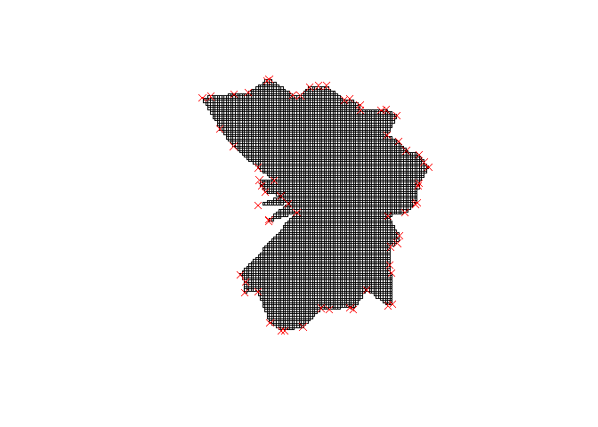<!-- --> \## Criando
o contorno e CAT

``` r
contorno_cat <- data_set |> 
  group_by(unidade,x,y) |> 
  summarise(
    n=n(),
    .groups = "drop"
  ) |> 
  filter(unidade == "CAT") |> 
  mutate(
    x1=mean(x),
    y1=mean(y),
    ang_rad = round(atan2(y-y1,x-x1),1),
    distancia = sqrt((x - x1)^2 + (y - y1)^2),
  ) |> 
  group_by(ang_rad) |> 
  mutate(
    max_dist = max(distancia)
  ) |> 
  ungroup() |> 
  mutate(flag_dist =distancia == max_dist) |> 
  filter(flag_dist)  |> 
  arrange(ang_rad) |> 
  select(x,y) |>   
  as.data.frame()
contorno_cat <- rbind(contorno_cat, contorno_cat[1,]) 
```

``` r
ggplot(contorno_cat, aes(x = x, y = y)) +
  geom_polygon(fill = "red4", color = "black") +
  coord_equal() +  # Mantém proporção real dos eixos
  theme_minimal()
```

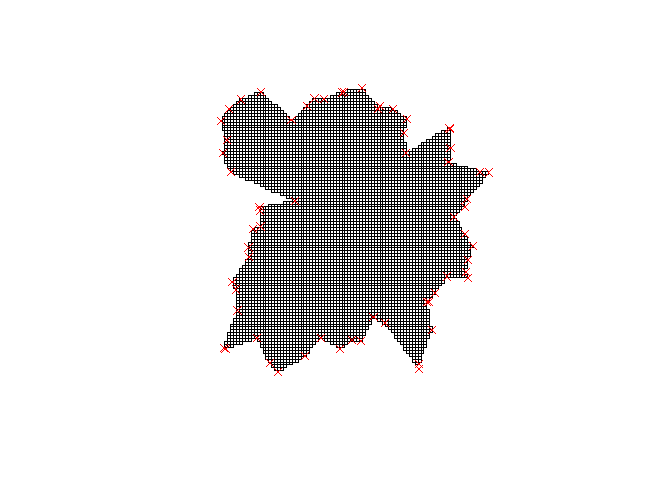<!-- -->

``` r
contorno_total <- rbind(contorno_cat |> 
                    mutate(unidade="CAT"),
                  contorno_pot |> 
                    mutate(unidade="POT"))
contorno_total |> ggplot(aes(x = x, y = y, group = unidade, fill = unidade)) +
  geom_polygon(color = "black", alpha = 0.5) +
  coord_equal() +
  theme_minimal()+
  geom_point(data = data_set |> 
               filter(ano == 2018),
             aes(x,y,color=unidade))
```

<!-- -->

## 3. Análise e modelagem geoestatística (2016 e 2017) e por UNIDADE.

## 4. Aprendizado de máquina com validação final a partir dos dados de 2018 e por UNIDADE
